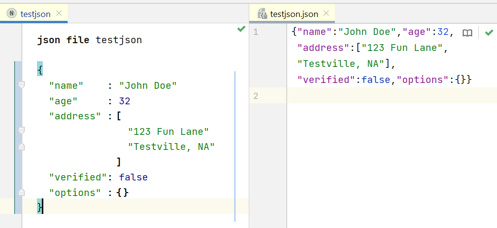
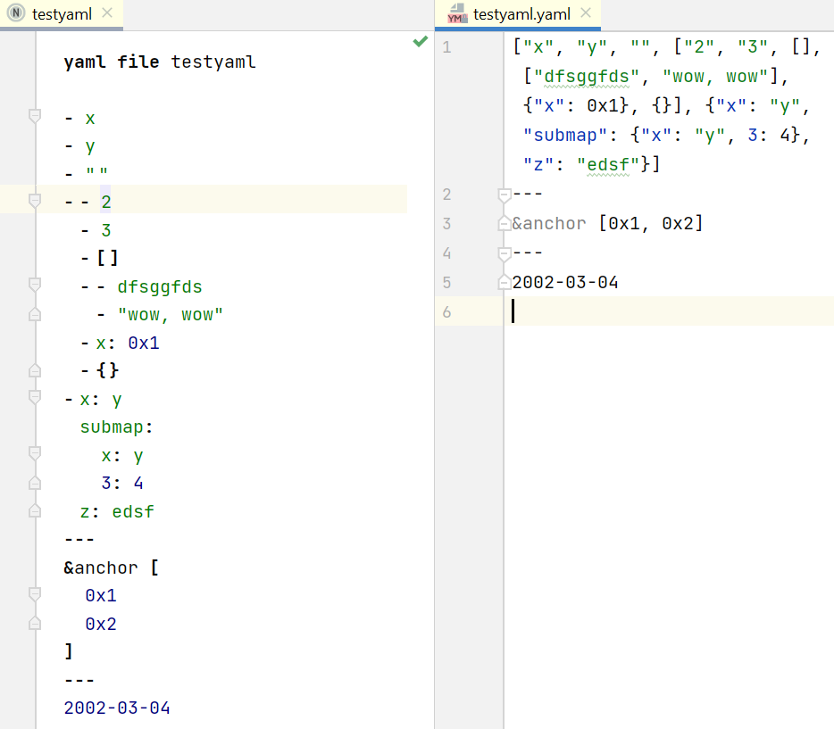
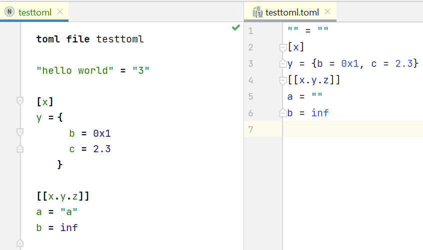
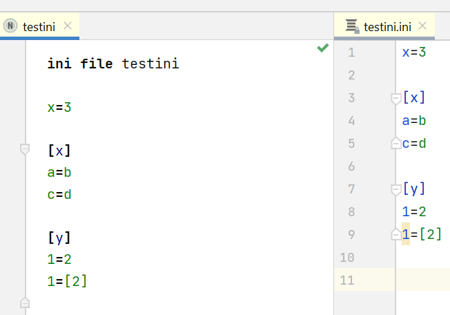

# DataFormats

DataFormats is a collection of languages for [JetBrains MPS](https://www.jetbrains.com/mps/) that allow you to target
and generate [JSON](https://www.json.org/json-en.html), [YAML](https://yaml.org/), [TOML](https://toml.io/en/), and
[INI](https://en.wikipedia.org/wiki/INI_file) files.

## Examples

   

## Installing

Installing DataFormats is as easy as installing the
[plugin](https://plugins.jetbrains.com/plugin/16835-dataformats) from your IDE.

## TODO

* Improve editing experience.
* Add more formats. Suggestions are always welcome! 
